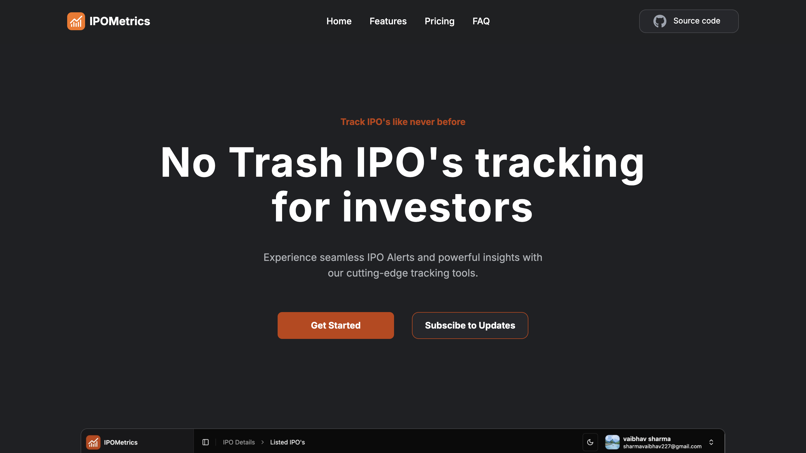

[This](https://ipometrics.com) is a landing page for [IPO Metrics](https://app.ipometrics.com).

# IPOMetrics: Revolutionizing IPO Tracking for Modern Investors

In today's fast-paced financial markets, staying ahead of Initial Public Offerings (IPOs) can make the difference between a good investment and a great one. Enter IPOMetrics, a cutting-edge platform that's transforming how investors track and analyze IPO opportunities.

## A New Era of IPO Tracking

IPOMetrics stands out in the crowded fintech space by offering what many investors have been seeking: a clean, intuitive platform dedicated to "No Trash IPO tracking." This refreshing approach means investors can focus on quality opportunities without wading through unnecessary noise.

## Key Features That Set IPOMetrics Apart

### 1. Real-Time GMP Tracking

One of the platform's standout features is its sophisticated Grey Market Premium (GMP) tracking system. Investors can:

- Set unlimited GMP alerts
- Define custom thresholds
- Receive customizable email notifications
- Access first-in-market GMP data

### 2. Developer-Friendly API Integration

For tech-savvy investors and developers, IPOMetrics offers robust API capabilities:

- Real-time IPO data access
- Seamless integration possibilities
- Fast and accurate data delivery
- Up to unlimited API calls (depending on plan)

### 3. Modern User Experience

The platform breaks away from traditional financial websites with:

- A contemporary, intuitive interface
- Cross-device compatibility
- Light and dark mode options
- User-friendly dashboard design

## Flexible Pricing for Every Investor

IPOMetrics offers three thoughtfully structured plans:

**Beginner (Free)**

- Perfect for new investors
- Unlimited GMP alerts
- Basic IPO tracking
- Ad-free experience

**Standard ($5/month)**

- Enhanced features for serious investors
- Developer API access
- Customizable alert emails
- Up to 25 daily API calls
- Dedicated customer support

**Premium ($20/month)**

- Unlimited API access
- Beta feature access
- Custom feature requests
- Priority support

## Why IPOMetrics Matters

In an investment landscape where timing and information are crucial, IPOMetrics provides the tools needed to make data-driven decisions. The platform's focus on clean, relevant data and real-time tracking capabilities makes it an invaluable resource for both individual investors and developers.

## Customer-Centric Approach

IPOMetrics backs its technology with strong customer support:

- 10-day money-back guarantee
- Flexible plan switching
- Responsive support team
- Comprehensive FAQ resources

## Looking Ahead

As the IPO market continues to evolve, IPOMetrics positions itself as more than just a tracking tool – it's a comprehensive solution for modern investors who demand quality, speed, and reliability in their investment research.

## Conclusion

For investors seeking a modern, efficient way to track IPOs, IPOMetrics offers a compelling solution. With its combination of real-time data, developer-friendly features, and user-centric design, it's poised to become an essential tool in any serious investor's arsenal.

Visit [IPOMetrics](https://ipometrics.com/) to transform your IPO tracking experience today.
